## What is OOP?
- Object-oriented programming (OOP) is a programming paradigm based on the concept of "objects", which may contain data, in the form of fields, often known as attributes; and code, in the form of procedures, often known as methods. For example, a person is an object which has certain properties such as height, gender, age, etc. It also has certain methods such as move, talk, and so on.
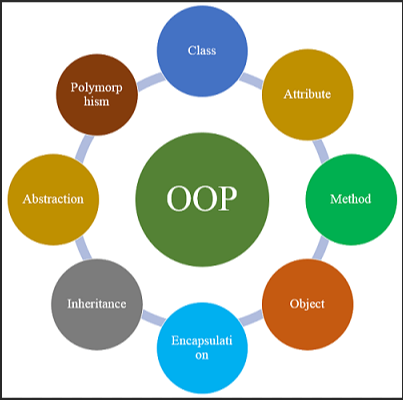

## What are the four pillars?
- **Abstraction** − It refers to, providing only essential information to the outside world and hiding their background details.
- **Encapsulation** − Encapsulation is a process of binding data members (variables, properties) and member functions (methods) into a single unit. It is also a way of restricting access to certain properties or component. The best example for encapsulation is a class
- **Inheritance** − The ability to create a new class from an existing class is called Inheritance. Using inheritance, we can create a Child class from a Parent class such that it inherits the properties and methods of the parent class and can have its own additional properties and methods. For example, if we have a class Vehicle that has properties like Color, Price, etc, we can create 2 classes like Bike and Car from it that have those 2 properties and additional properties that are specialized for them like a car has numberOfWindows while a bike cannot. Same is applicable to methods.
- **Polymorphism** − The word polymorphism means having many forms. Typically, polymorphism occurs when there is a hierarchy of classes and they are related by inheritance.  Polymorphism means that a call to a member function will cause a different function to be executed depending on the type of object that invokes the function.

## What are the benefits?
- Modularity for easier troubleshooting
- Reuse of code through inheritance
- Flexibility through polymorphism
- Effective problem solving
- 

## Functionality of each pillar
### Abstraction
- Abstraction in python is defined as a process of handling  complexity by hiding unnecessary information from the user.This is one of the core concepts of object-oriented programming languages.
- Abstraction provides a programmer to hide all the irrelevant data/process of an application in order to reduce complexity and increase the efficiency of the program

**Abstraction in real world:**
- For the sake of understanding let us have an example as we all use the social platforms and contact our friends, chat, share images etc., but we don’t know how these operations are happening in the background. 
- Let us take another example, while visiting and reading blogs on the learning platforms we tend to click on various links and perform various functions unknowingly what is happening in the background. That is exactly the abstraction that works in the OOP.
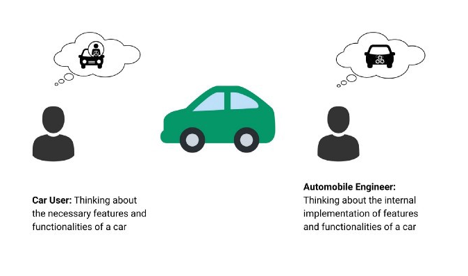

### Encapsulation:
- Encapsulation is one of the fundamental concepts in object-oriented programming (OOP). It describes the idea of wrapping data and the methods that work on data within one unit. This puts restrictions on accessing variables and methods directly and can prevent the accidental modification of data. 
- To prevent accidental change, an object’s variable can only be changed by an object’s method. Those types of variables are known as private variables.

- A class is an example of encapsulation as it encapsulates all the data that is member functions, variables, etc.


**Encapsulation in real world:**
- Consider a real-life example of encapsulation, in a company, there are different sections like the accounts section, finance section, sales section etc. The finance section handles all the financial transactions and keeps records of all the data related to finance. Similarly, the sales section handles all the sales-related activities and keeps records of all the sales. Now there may arise a situation when for some reason an official from the finance section needs all the data about sales in a particular month. In this case, he is not allowed to directly access the data of the sales section. He will first have to contact some other officer in the sales section and then request him to give the particular data. This is what encapsulation is. Here the data of the sales section and the employees that can manipulate them are wrapped under a single name “sales section”. Using encapsulation also hides the data. In this example, the data of the sections like sales, finance, or accounts are hidden from any other section.

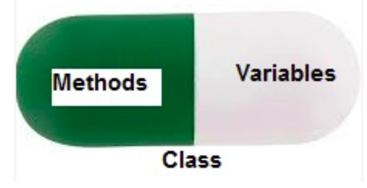

### Inheritance :
- Inheritance is one of the most important concepts of Object-Oriented Programming.
- Inheritance is the capability of one class to inherit capabilities or properties from another class 
**Inheritance in real world:**
- We inherit certain properties from the class ‘Human’ such as the ability to speak, breathe, eat, drink, etc.We can also take the example of cars. 
- The class ‘Car’ inherits its properties from the class ‘Automobiles’ which inherits some of its properties from another class ‘Vehicles’.
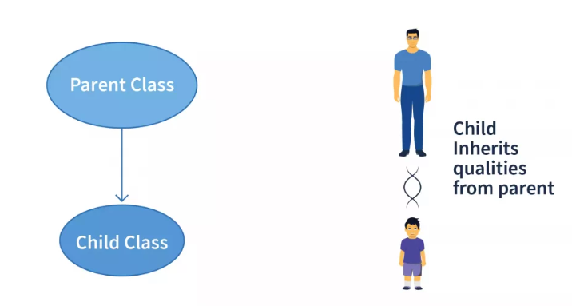

### Polymorphism :
- Polymorphism is among the fundamental concepts of OOP and is a term used to describe situations where something takes various roles or forms.In programming world, these things can be operator or functions

**Inheritance in real world:**
- One of the best real time example of polymorphism is Women in the society. The same woman performs different role in society.The woman can be wife of someone, mother of her child, can be at role of manager in organisation and many more at the same time. But the Woman is only one. So, same woman performing different roles is polymorphism.
- Another good real time example of polymorphism is water. Water is a liquid at normal temperature, but it can be changed to solid when it frozen, or same water changes to a gas when it is heated at its boiling point.Thus, same water exhibiting different roles is polymorphism.
- Another excellent real time example of polymorphism is your smartphone.The smartphone can act as phone, camera, music player and what not, taking different forms and hence polymorphism
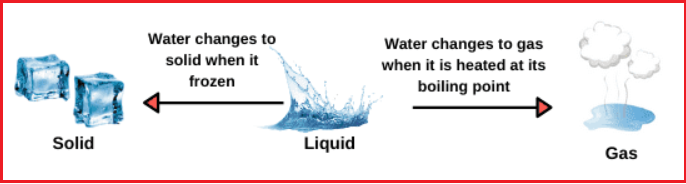

- Refactored program of fizzbuzz
```python
def fizzbuzz(ran) :
    for i in range (1,ran) : print ("Fizz"*(i%3==0)+"Buzz"*(i%5==0) or str(i))

ran = int(input("Please enter the range :"))

fizzbuzz(ran)
```
- Output of the program 

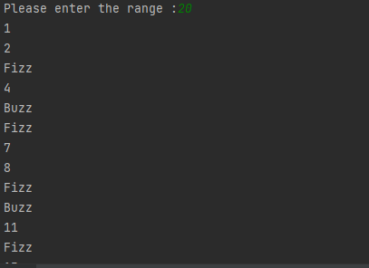

- Refactored program of calculating age:
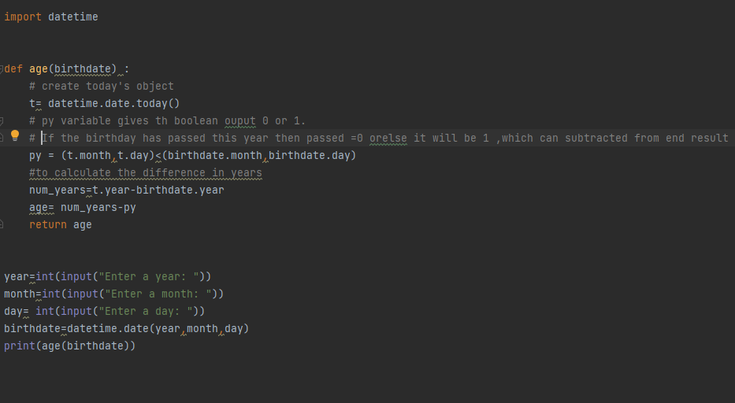
-  Output of the program 

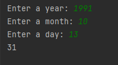

- Refactored program of restaurant helper:
```python
# AS a User I want to be able to see the menu in a formated way, so that I can order my meal.
def restaurant_helper():
 menu_list=["Burger","Fries","Wrap","noodles","chickenwings","friedrice"]
 print(menu_list)
#AS a User I want to be able to order 3 times, and have my responses added to a list so they aren't forgotten

 customer_selected_items=input("Select the items from the menu: ").split()
 return customer_selected_items
 # As a user, I want to have my order read back to me in formated way so I know what I ordered.

print("order :" ,restaurant_helper())
```
-  Output of the program 

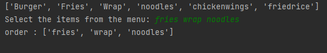

- Refactored program of movie rating:
```python
def movierating(age):


 if age >= 18 and age <= 117:
    print("You are allowed to watch all the movies")
 elif age >= 16 and age <18:
    print("These movies are only for 16 years and above ")
 elif age >= 15 and age <16:
    print("These movies are only for 15 years and above")
 elif age >= 12 and age <15:
    print("These movies are only for 12 and above")
 elif age > 117:
    print("Please enter the correct age")
 else:
    print("please enter only digits")

age=int(input("Please , enter your age:"))
movierating(age)
```
- Output of the program 

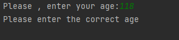
- Refactored program of student_data
```python
def student_data():
 # create a dictionary student_data

 student_data={"first_name":"Meghana","last_name":"Aenugu","dob":"13/10/1992","course":"DevOps","hobbies":"badminton"}
 # iterate through the dict
 for i in student_data:
    print(i)
 #print all the keys
 print(student_data.keys())
 # print all the values
 print(student_data.values())
 # print key with matching value name ="Meghana"
 for i in student_data:
  if student_data[i]=="Meghana":
    print(i)
    
student_data()
```
- Output of the program

 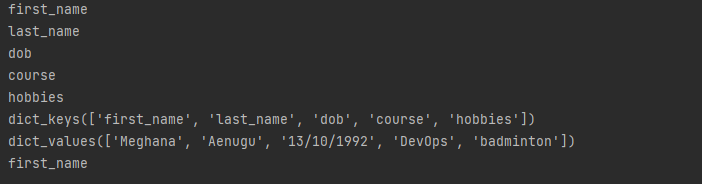
 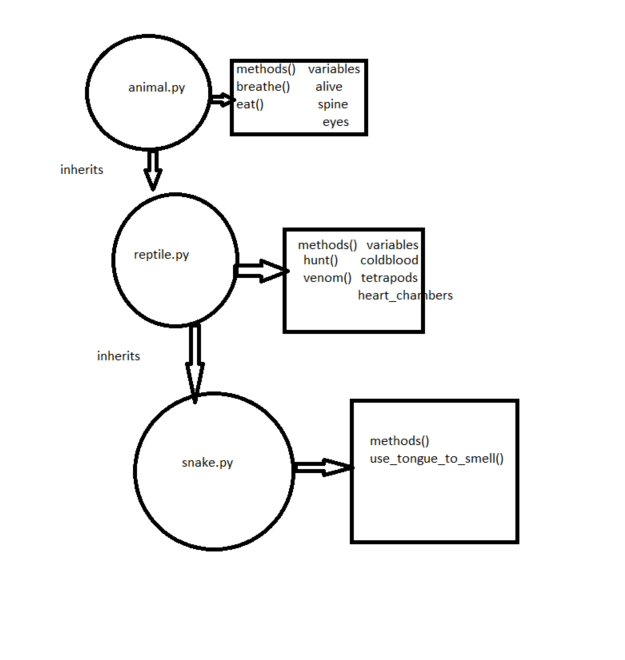
- step 1: create animal.py as parent
```python
# create a class called Animal - file name starts with a- class name starts with A
# add the common attibutes/var behaviour/functions
# syntax class name: class Animal:

class Animal: #follow the correct naming convention & best practises
    # we need to initialise with builtin method called __init__(self)
    # self refers to current class
    def __int__(self):# any attributes attached to the class should be part of __init__method
        # self.var = True
        self.alive = True
        self.spine = True
        self.eyes = True
# Let's create some methods to add common behaviours
    def breathe(self):
        return" keep breathing to stay alive "
# Let's add one more behaviour
    def eat(self):
        return "time to eat ....!"

# create an object of this class

cat = Animal()# creating an object of animal class

# print(cat.breathe())# calling the method using object of the Animal class
# print(cat.eat())
```
  
- step 2: create reptile.py as a child to inherit-abstract etc
```python
from animal import Animal # importing everything from Animal class
class Reptile(Animal): # Inherit from Animal class
    def __init__(self):

        self.cold_blooded=True
        self.tetrapods=None
        self.heart_chambers =[3,4]

    def hunt(self):
        return "keep working hard to find food !"
    def use_venom(self):
        return "If I have it I will use it"
smart_reptile = Reptile()
print(smart_reptile.breathe())
print(smart_reptile.hunt())
```
- step 3: snake.py & inherit from reptile
```python
from reptile import Reptile

class Sk(Reptile):

    def __init__(self):
        super().__init__()

    def use_tongue_to_smell(self):
        return " if I can touch itI can smell it as well "

smart_sk = Sk()
print(smart_sk.hunt())
print(smart_sk.use_tongue_to_smell())
print(smart_sk.breathe())
```
- step 4: python_oop.py 
```python
from snake import Sk
class Python_oop(Sk):
    def __init__(self):
        super().__init__()
        self.large=True

    def swallow(self):
        return "Python can swallow"

py = Python_oop()

print(py.swallow())# printing same class method
print(py.breathe())# printing greatgrand parent method
print(py.hunt())# printing grand parent method
print(py.use_tongue_to_smell())# using parent class method

```