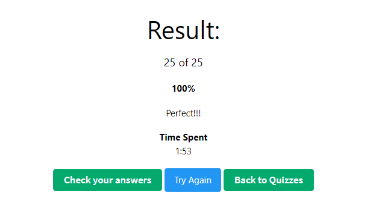
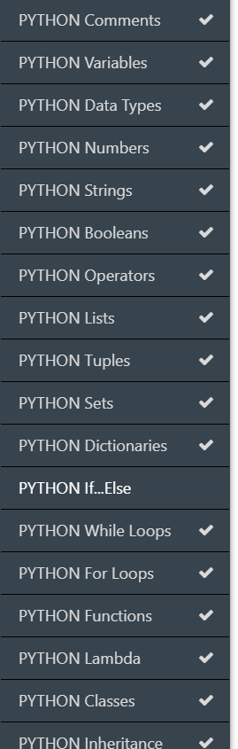
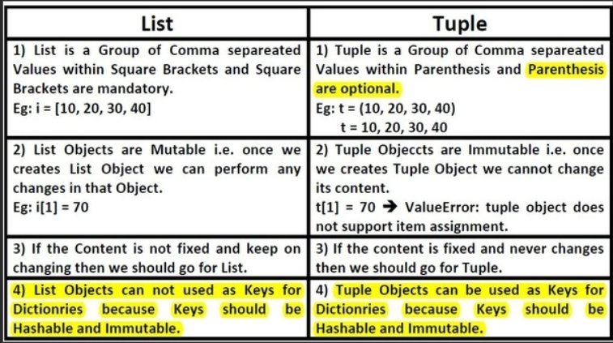

- What's the difference between a list and tuple?
 
- could you have multiple options inside a tuple
   - Tuples are used to store multiple items in a single variable.

   - Tuple is one of 4 built-in data types in Python used to store collections of data, the other 3 are List, Set, and Dictionary, all with different qualities and usage.

   - A tuple is a collection which is ordered and unchangeable.

   - Tuples are written with round brackets.
  
- syntax declaration of Python 
   - list - []
   - tuple -()
   - set- {}
   - dict -{"key":"value"}
- Python package modules -library
  **sys**:
  - The sys module in Python provides various functions and variables that are used to manipulate different parts of the Python runtime environment. It allows operating on the interpreter as it provides access to the variables and functions that interact strongly with the interpreter. Let’s consider the below example.
  - Example:
    - import sys
      print(sys.version)
  
  *Input and Output using sys*:
  - The sys modules provide variables for better control over input or output. We can even redirect the input and output to other devices. This can be done using three variables – 
     - stdin
     - stdout
     - stderr
    
  - stdin: It can be used to get input from the command line directly. It is used for standard input. It internally calls the input() method. It, also, automatically adds ‘\n’ after each sentence.
  - stdout: A built-in file object that is analogous to the interpreter’s standard output stream in Python. stdout is used to display output directly to the screen console. Output can be of any form, it can be output from a print statement, an expression statement, and even a prompt direct for input. By default, streams are in text mode. In fact, wherever a print function is called within the code, it is first written to sys.stdout and then finally on to the screen. 

      - Example:
      - import sys
      - sys.stdout.write('Geeks')
  - stderr: Whenever an exception occurs in Python it is written to sys.stderr.
  
  
 

 

